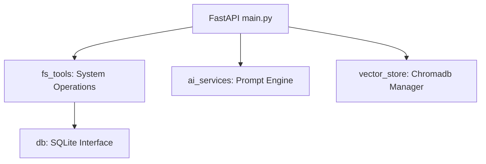

# AI File System Model Context Protocol (MCP) Server & Console Portal

An enterprise-grade, secure, and intuitive Developer Assistant and codebase analysis portal. The application integrates a custom **MCP Server** built with the FastMCP SDK, a **FastAPI backend** managing database state and similarity vector indexing, and a premium **Streamlit dashboard interface**.

---

## 📖 Project Overview

This portal provides a secure local environment that allows developers to:
1. **Upload folder ZIPs**: Automatically extract and analyze a workspace safely.
2. **Semantic Search**: Index codebases into a local ChromaDB for similarity code searches.
3. **Static Audit Scan**: Automatically perform dependency audits, security scanning (secrets/keys leak detection), and code quality checks.
4. **Agent Integration**: Run as an MCP Server so AI agents can safely locate, read, or modify codebase resources.

---

## ⚡ Key Features

- **Folder Upload & Sandboxing**: Confines all file operations to a sandbox directory to prevent directory traversal breakouts.
- **Static Auditing**: Parses dependencies, frameworks, and detects hardcoded secrets/API keys via regex signatures.
- **Mermaid Graph Render**: Dynamically creates component relationships flowcharts rendered via Mermaid.
- **RAG Chat**: Context-aware developer AI chat mapping project files.

---

## 📊 System Architecture

### High-Level Architecture


### Component Interaction Flow


---

## 📂 Project Structure

```text
ai-filesystem-mcp/
├── backend/
│   ├── database/
│   │   ├── db.py            # SQLite database logic and logs
│   │   └── metadata.db      # SQLite binary database
│   ├── mcp_server/
│   │   └── server.py        # FastMCP SDK Tool definitions
│   ├── services/
│   │   └── ai_services.py   # AI prompts orchestration
│   ├── tools/
│   │   └── fs_tools.py      # ZIP extraction, file tree, security auditing
│   ├── utils/
│   │   └── security.py      # Confined sandbox resolver
│   ├── vectorstore/
│   │   └── vector_store.py  # ChromaDB indexing client
│   └── main.py              # FastAPI app routing
├── frontend/
│   └── app.py               # Streamlit Multi-page Dashboard
├── workspace/               # Confined sandbox directory
├── tests/                   # Pytest suite
├── requirements.txt         # Package dependencies
└── README.md                # System documentation
```

---

## 📡 API Design

| Endpoint | Method | Description |
|---|---|---|
| `/upload-zip` | `POST` | Upload and extract a workspace ZIP archive safely. |
| `/analyze-project` | `POST` | Retrieve statistics, architecture framework details, and AI summaries. |
| `/security-scan` | `POST` | Audits files for hardcoded secrets, api keys, and passwords. |
| `/dependency-analysis`| `POST` | Inspects dependencies for outdated or unused packages. |
| `/architecture` | `POST` | Generates a Mermaid architecture diagram of the codebase. |
| `/chat` | `POST` | Context-aware RAG chat assistant query endpoint. |

---

## 🚀 Setup & Deployment

### 1. Requirements & Configuration
Create a `.env` file in the root directory:
```env
GROQ_API_KEY=your-groq-api-key-here
# Optional
OPENAI_API_KEY=your-openai-api-key-here
GEMINI_API_KEY=your-gemini-api-key-here
```

### 2. Run Locally
```bash
# 1. Install Dependencies
pip install -r requirements.txt

# 2. Start FastAPI Backend
uvicorn backend.main:app --host 127.0.0.1 --port 8000 --reload

# 3. Start Streamlit Frontend
streamlit run frontend/app.py
```

### 3. Docker Compose (Production Setup)
```bash
docker-compose up --build
```
Access the application dashboard at `http://localhost:8501`.

---

## 🧪 Testing
Run the pytest test suite to verify code sanitization, folder boundaries, and API integrations:
```bash
.venv\Scripts\python -m pytest tests/
```

---

## 📄 License
Distributed under the Apache 2.0 License.
